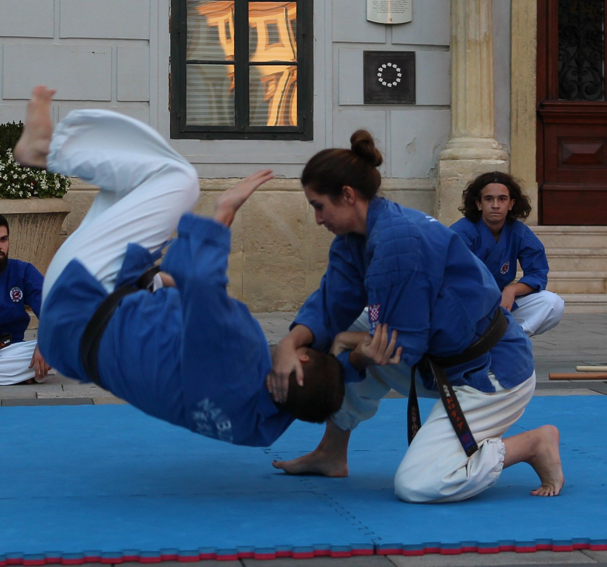
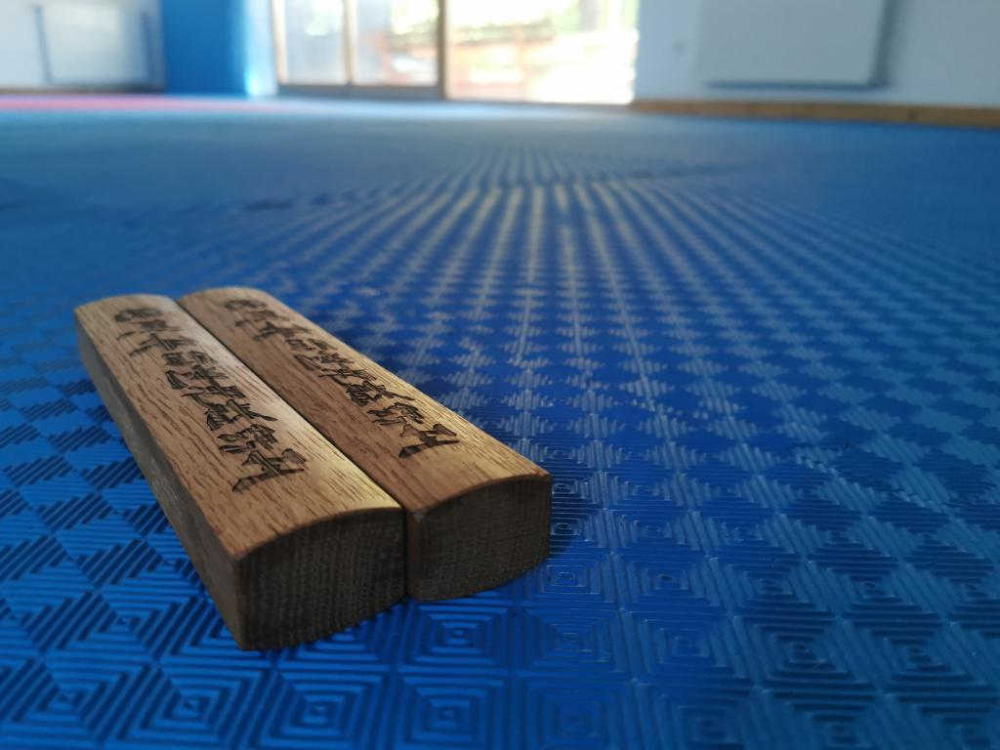
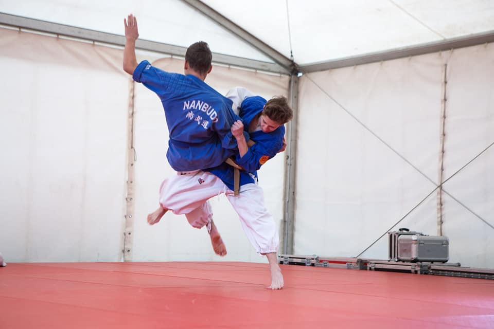
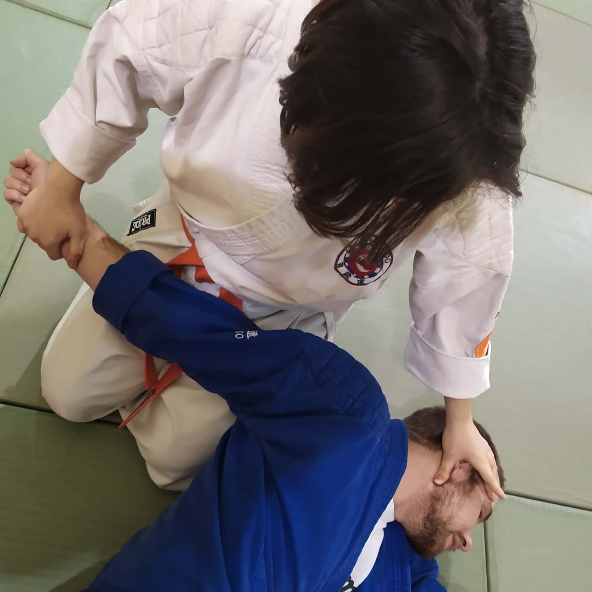
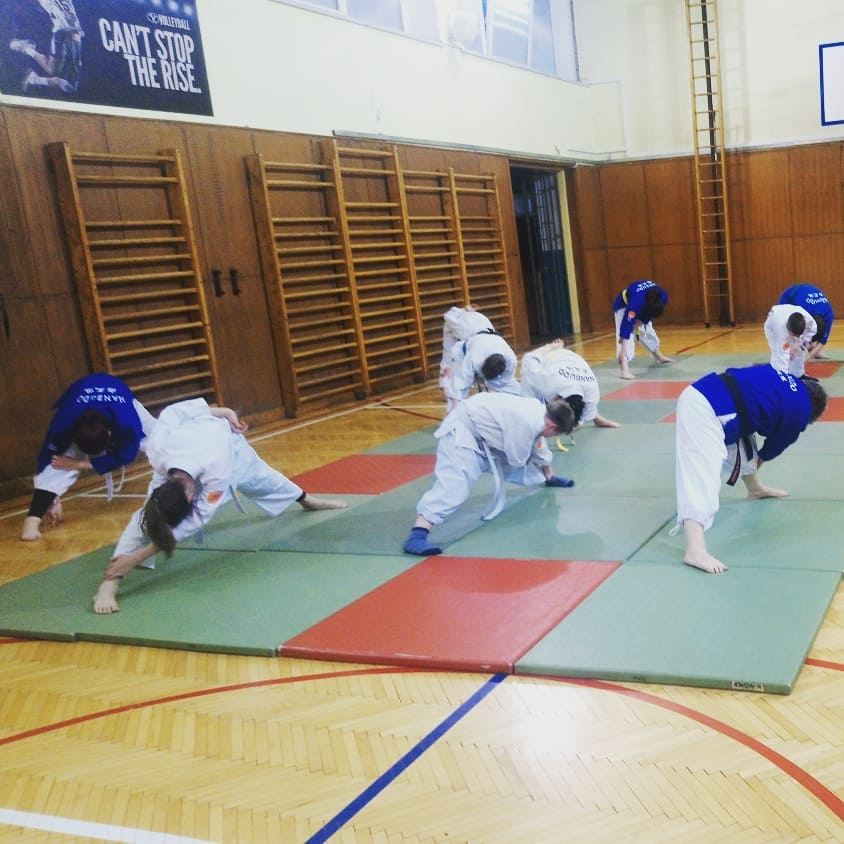
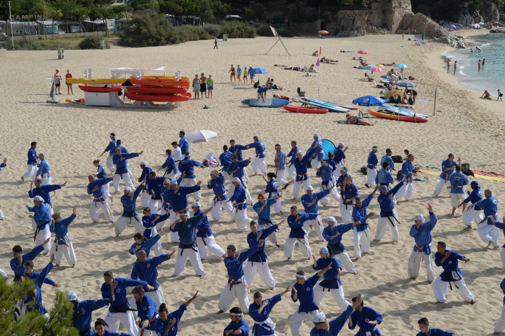
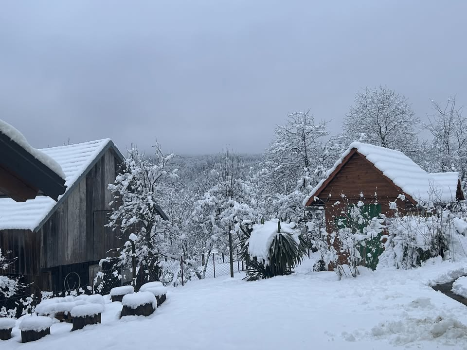

# Images from Original Site

## Favicon/Logo
- **File**: `sunce-favicon.png` 
- **URL**: https://nanbudoklub-sunce.hr/sunce-favicon.png
- **Usage**: Site icon (appears in browser tab)

## Instructor Photos
- **Mihael Župančić**: `miha.jpg`
- **Dorotea Župančić**: `dora1.jpg`

## Gallery/Training Images
- `trening.jpg` — "Strukturirani trening nanbudoa za mlade"
- `mico2.jpg` — "Slika s treninga"
- `mirta.jpg` — "Prikaz tehnike"
- `trening2.jpg` — "Tim kluba"
- `seminar.jpeg` — "Slika sa seminara"
- `yoshinao nanbu s djecom-min.jpg` — "Upisi u novu sezonu"
- `zimski.jpg` — "Nanbudo seminar"

## Download Instructions

1. Create `images/` folder in your project
2. Download each image from: `https://nanbudoklub-sunce.hr/[filename]`
3. Organize like this:
   ```
   images/
   ├── favicon.png                 (from sunce-favicon.png)
   ├── instructors/
   │   ├── mihael.jpg
   │   └── dorotea.jpg
   └── gallery/
       ├── trening.jpg
       ├── mico2.jpg
       ├── mirta.jpg
       ├── trening2.jpg
       ├── seminar.jpeg
       └── zimski.jpg
   ```

## How to Add to Website

### 1. Add Favicon to index.html `<head>`:
```html
<link rel="icon" type="image/png" href="images/favicon.png">
```

### 2. Add Instructor Photos
Replace the avatar circles in `index.html`:
```html


```

### 3. Add Gallery Section
Add before Contact section:
```html
<section class="gallery">
    <div class="container">
        <div class="section-header">
            <h2>Galerija</h2>
            <div class="accent-line"></div>
        </div>
        <div class="gallery-grid">
            
            
            
            
            
            
        </div>
    </div>
</section>
```

### 4. Add Gallery CSS to styles.css:
```css
.gallery {
    background: var(--white);
}

.gallery-grid {
    display: grid;
    grid-template-columns: repeat(auto-fit, minmax(280px, 1fr));
    gap: 1.5rem;
}

.gallery-grid img {
    width: 100%;
    height: 250px;
    object-fit: cover;
    border-radius: 4px;
    box-shadow: var(--shadow-sm);
    transition: var(--transition);
}

.gallery-grid img:hover {
    transform: scale(1.05);
    box-shadow: var(--shadow-lg);
}
```

### 5. Update Instructor Avatar CSS in styles.css:
```css
.instructor-avatar {
    width: 120px;
    height: 120px;
    margin: 0 auto 1.5rem;
    border-radius: 50%;
    display: block;
    object-fit: cover;
    box-shadow: var(--shadow-md);
}
```

## Quick Download Links

```bash
# Download all images from original site
wget https://nanbudoklub-sunce.hr/sunce-favicon.png -O images/favicon.png
wget https://nanbudoklub-sunce.hr/miha.jpg -O images/instructors/mihael.jpg
wget https://nanbudoklub-sunce.hr/dora1.jpg -O images/instructors/dorotea.jpg
wget https://nanbudoklub-sunce.hr/trening.jpg -O images/gallery/trening.jpg
wget https://nanbudoklub-sunce.hr/mico2.jpg -O images/gallery/mico2.jpg
wget https://nanbudoklub-sunce.hr/mirta.jpg -O images/gallery/mirta.jpg
wget https://nanbudoklub-sunce.hr/trening2.jpg -O images/gallery/trening2.jpg
wget https://nanbudoklub-sunce.hr/seminar.jpeg -O images/gallery/seminar.jpeg
wget https://nanbudoklub-sunce.hr/zimski.jpg -O images/gallery/zimski.jpg
```

Or use a browser to download manually by right-clicking each image.
